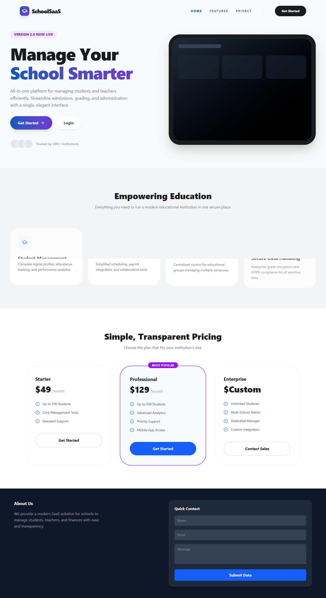
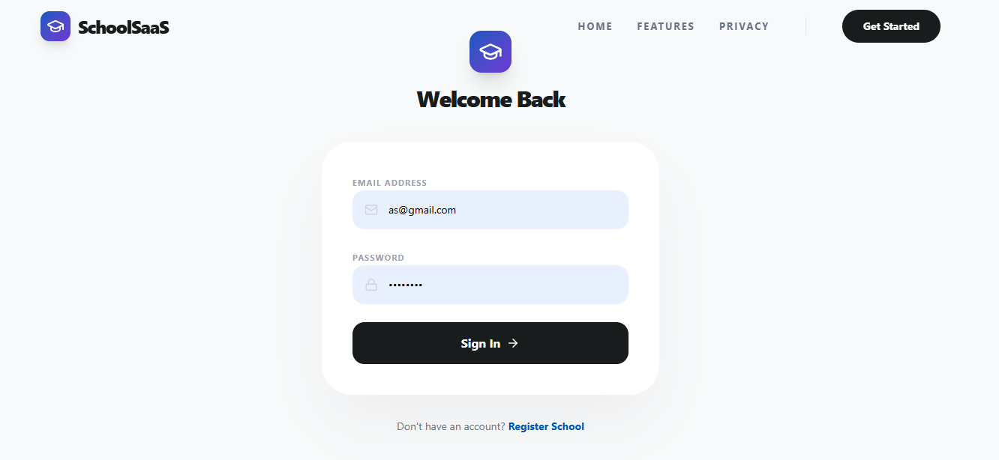
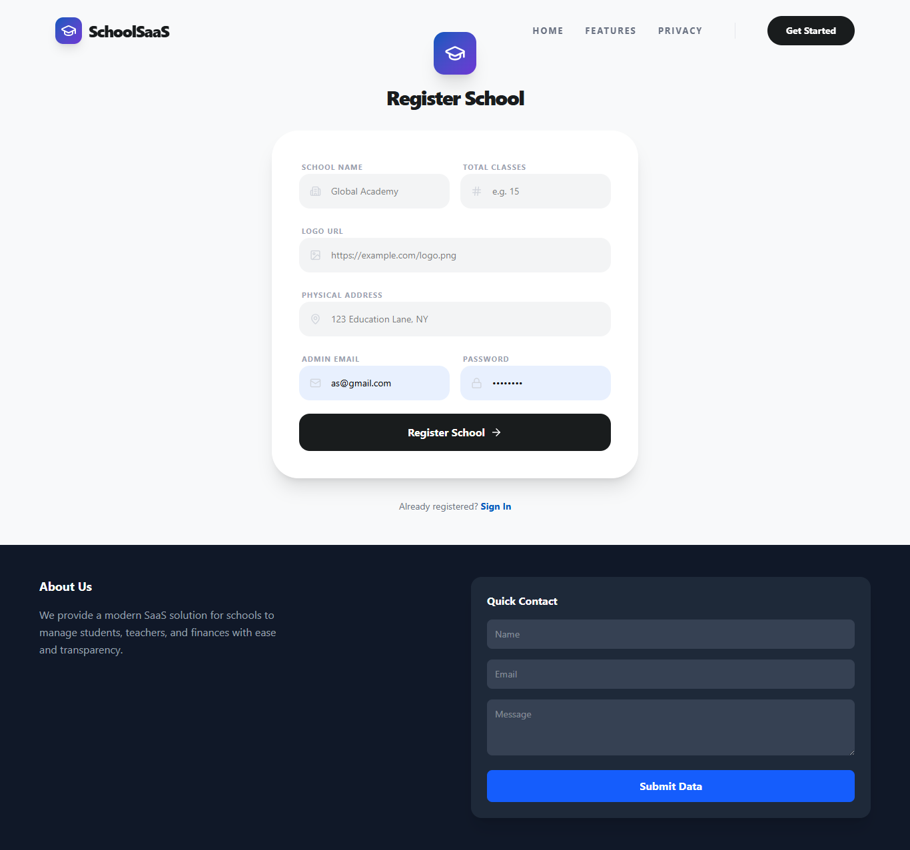
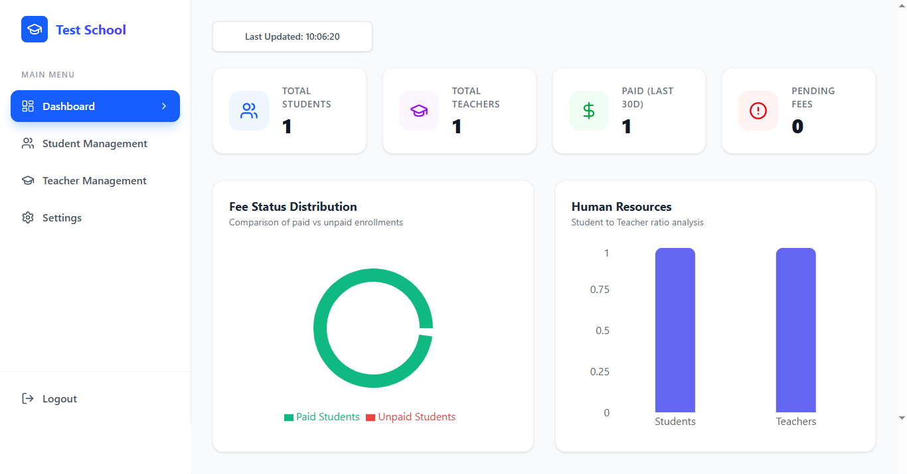
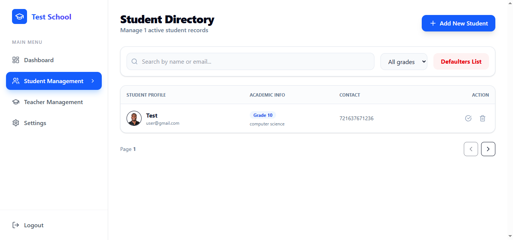
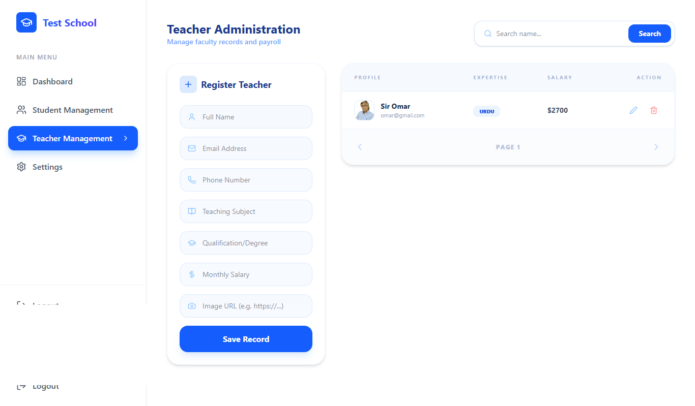
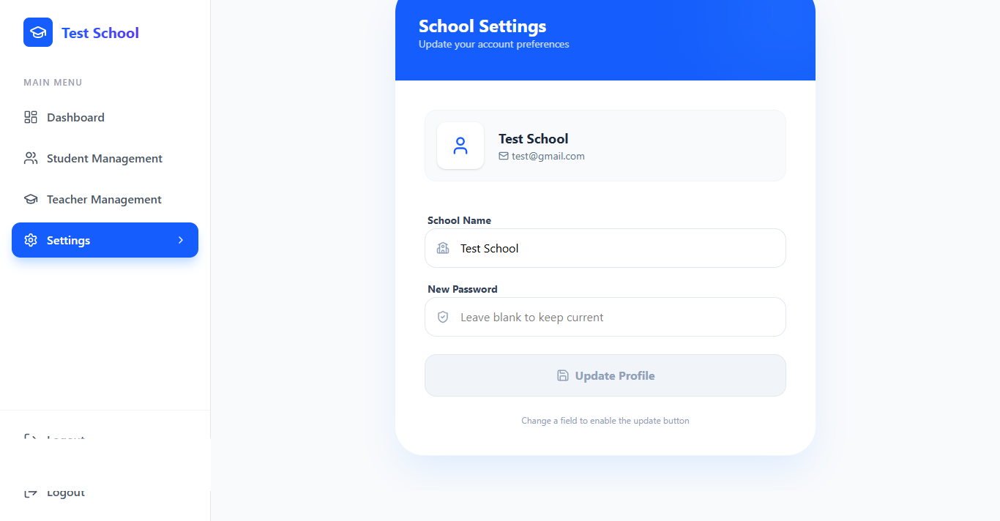
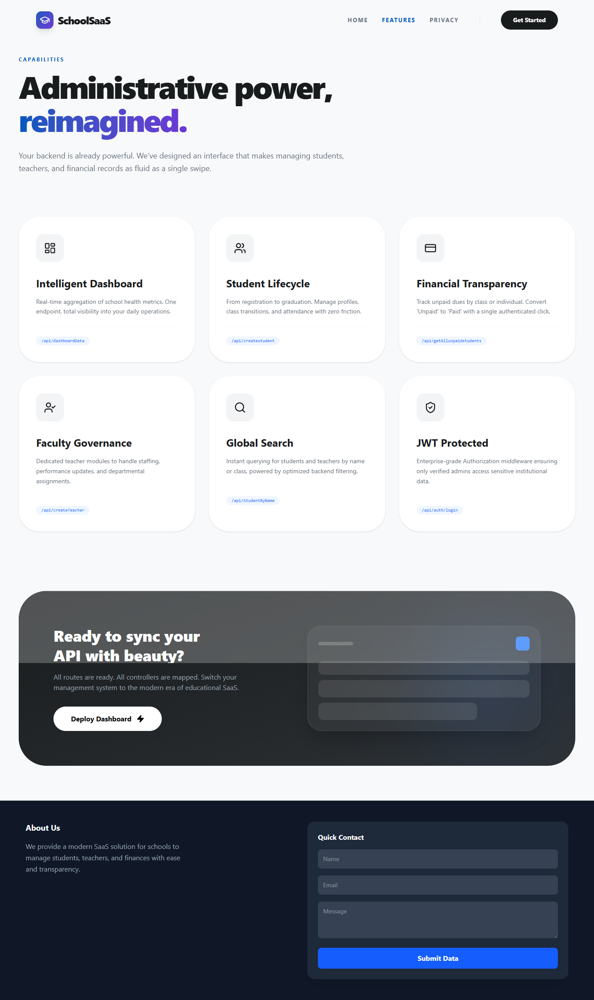
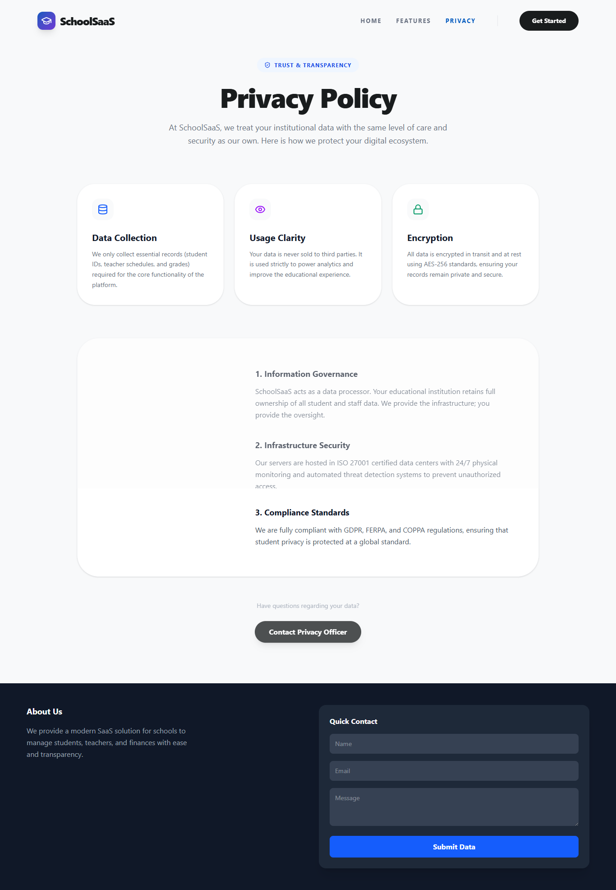
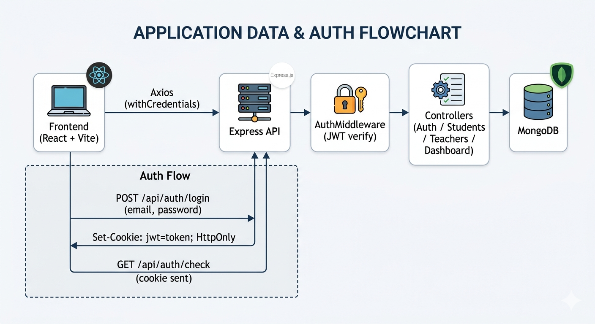

## SchoolApp – Tech Stack

Modern school management SaaS built with a clean Node/Express backend and a React/Vite frontend.

### Tech Stack (with logos)

  
  
  
  
  
  
  
  
  
  
  
  

- Frontend walkthrough:

<video src="./images/frontend.mp4" controls width="100%"></video>

- **Backend**: Node.js, Express, MongoDB (Mongoose), JWT auth, rate limiting, cookie-based sessions
- **Frontend**: React, Vite, Tailwind CSS, Framer Motion, GSAP, Three.js (@react-three/fiber)
- **Validation/UX**: Zod validation, React Hot Toast for feedback
- **HTTP**: Axios with `withCredentials` for cookie auth

### Key Backend Endpoints
- Auth: `POST /api/auth/register`, `POST /api/auth/login`, `GET /api/auth/check`, `PUT /api/auth/update`
- Students: `POST /api/createstudent`, `GET /api/students`, `GET /api/getAllunpaidstudents`, `GET /api/getallstudentsbyclassname`, `GET /api/getAllunpaidstudentsbyclassname`, `GET /api/StudentByName`, `PUT /api/updatestudent/:id`, `PUT /api/setunpaidstudent/:id`, `DELETE /api/deletestudent/:id`
- Teachers: `POST /api/createTeacher`, `GET /api/getAllteacher`, `PUT /api/updateTeacher/:teacherid`, `DELETE /api/deleteTeacher/:teacherid`, `GET /api/searchTeacher`
- Dashboard: `GET /api/dashboradData`

### Screenshots

Below are some app screenshots located in the `images/` folder:

### System Structure

If you find this project helpful, please consider giving it a star. Thank you!

### Authentication
- **Token-based auth with cookies**:
  - On successful login/register, server issues a signed JWT and sets it in an `HttpOnly` cookie `jwt` (Lax, not Secure in dev).
  - Subsequent requests to protected routes automatically include the cookie (Axios `withCredentials`).
  - Middleware accepts either cookie or `Authorization: Bearer <token>` header, but the primary flow uses the cookie.
  - Session validation: `GET /api/auth/check` returns school profile if the token is valid.

### Environment Variables (names only)
- Backend:
  - `Mongoose_URI`
  - `JWT_Secret`
- Frontend:
  - `VITE_API_BASE_URL`
